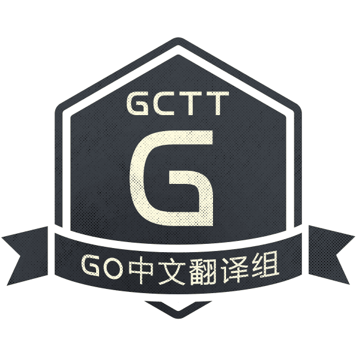
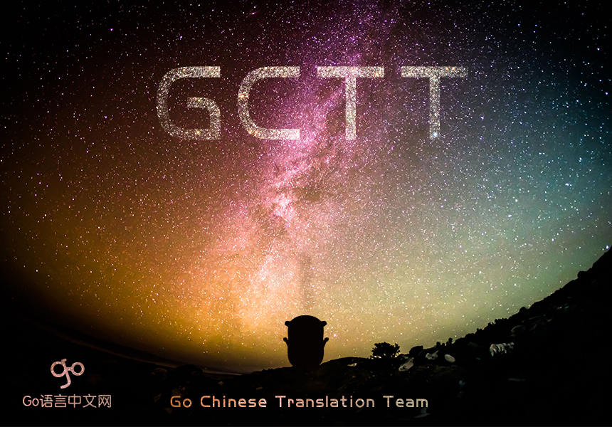

# GCTT Go 中文网翻译组

## 简介

GCTT (Go Chinese Translation Team) 是 Go 中文网（https://studygolang.com) 翻译组，负责从国外优秀媒体翻译 Go 相关的技术、教程、资讯、杂文等内容。

## GCTT 的组成

**选题**，负责选择合适的内容，在 [GCTT](https://github.com/studygolang/gctt) 库中提 issue，并打上 「待认领」 标签。

**译者**，负责从选题中选择内容进行翻译。

**校对**，负责将初译的文章进行文字润色、技术校对等工作。

**发布**，负责将校对后的文章，排版发布到 Go 中文网 的文章中。

## 加入我们

请首先加入翻译组的 QQ 群，群号是：423373670，加群时请说明是“志愿者”。加入后记得修改您的群名片为您的 GitHub 的 ID。**同时强烈建议注册 Go 中文网账号并和 GitHub 账号绑定，这样无论是翻译提醒和后期译文发布，都会和你的中文网账号关联。**

关注微信公众号：Go语言中文网

## 如何开始

加入的成员，请先阅读 [WIKI 如何开始](https://github.com/studygolang/GCTT/wiki)。

为了让大家更好地参与 GCTT，翻译组成员 [jarry](https://github.com/cureking) 录制了一套教学视频：

* [GCTT 翻译流程（Part I-准备工作，获取任务)](https://www.bilibili.com/video/av29042507)
* [GCTT 翻译流程（Part II-打开文章，翻译注意)](https://www.bilibili.com/video/av29292296)
* [GCTT 翻译流程（Part III-提交任务，修改错误)](https://www.bilibili.com/video/av30494605)

## 历史

* 2017/11/16 倡议并得到了大家的积极响应，成立翻译组。有人提到 LCTT 做的不错，因此仿照 LCTT，创立了 GCTT。
* 2017/11/17 完成了 GCTT 仓库文档等工作；并开始了翻译。
* 2017/11/19 Go 中文网 GCTT 官网开发并上线，主要是数据和 GitHub 同步。
* 2017/11/21 无闻加入 GCTT，参与校对工作。
* 2017/11/22 核心成员 Noluye 主导的 Go 系列教程翻译，发布第一篇。
* 2017/11/24 设计师 lijing 帮制作 GCTT logo 和 banner。
* 2017/11/24 待校对文章积压，提升 rxcai 为校对，主导校对工作。
* 2017/12/04 根据大家的建议，选题采用提 issue + label 的方式，解决不好找以及冲突等问题。
* 2017/12/07 根据 rxcai 的建议，提升 QueShengyao 为校对。
* 2018/03/01 提升 gogeof 为核心成员。
* 2018/03/23 提升 alfred-zhong 为核心成员。
* 2018/07/22 提升 magichan 为核心成员。
* 2018/09/07 提升 alexliutao 为核心成员。
* 2019/05/19 提升 JYSDeveloper 为核心成员。
* 2019/09/11 提升 DingdingZhou 为核心成员。
* 2019/09/16 提升 TomatoAres 为核心成员。
* 2019/09/29 提升 Watermelo 为核心成员。
* 2019/11/24 提升 lxbwolf 为核心成员。

## Inspire By LCTT

感谢 Linux 中国 的 [LCTT 项目](https://github.com/LCTT/TranslateProject)，此项目是 LCTT 项目在 Go 领域的一个实现！

## 已发布专栏

GCTT 翻译的文章发布在 Go 中文网 如下专栏：

* [GCTT - Go 中文翻译组](https://studygolang.com/subject/1)
* [Go 系列教程（Golang tutorial series）](https://studygolang.com/subject/2)

更多细分系列专栏：

* [Go 语言机制](https://studygolang.com/subject/74)
