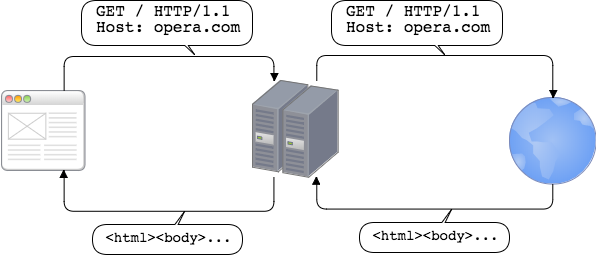
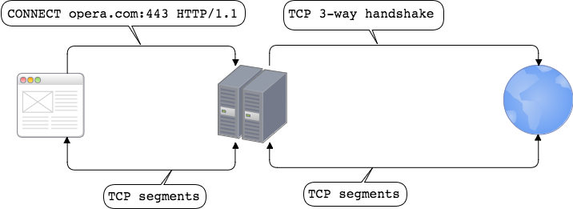

# 用不到 100 行的 Golang 代码实现 HTTP(S) 代理


我们的目标是实现一个能处理 HTTP 和 HTTPS 的[代理服务器](https://en.wikipedia.org/wiki/Proxy_server)。代理 HTTP 请求的过程其实就是一个解析请求、将该请求转发到目的服务器、读取目的服务器响应并将其传回原客户端的过程。这个过程只需要内置的 HTTP 服务器和客户端（[net/http](https://golang.org/pkg/net/http/)）就能实现。HTTPS 的不同之处在于使用了名为 “HTTP CONNECT 隧道”的技术。首先，客户端用 HTTP CONNECT 方法发送请求以建立到目的服务器的隧道。当这个由两个 TCP 连接组成的隧道就绪，客户端就开始与目的服务器的定期握手以建立安全的连接，之后就是发送请求与接收响应。

## 证书

我们的代理是一个 HTTPS 服务器（当使用 `--proto https` 参数），因而需要证书和私钥。我们使用自签名证书。用如下脚本生成：

```console
#!/usr/bin/env bash
case `uname -s` in
    Linux*)     sslConfig=/etc/ssl/openssl.cnf;;
    Darwin*)    sslConfig=/System/Library/OpenSSL/openssl.cnf;;
esac
openssl req \
    -newkey rsa:2048 \
    -x509 \
    -nodes \
    -keyout server.key \
    -new \
    -out server.pem \
    -subj /CN=localhost \
    -reqexts SAN \
    -extensions SAN \
    -config <(cat $sslConfig \
        <(printf '[SAN]\nsubjectAltName=DNS:localhost')) \
    -sha256 \
    -days 3650
```

需要让你的操作系统信任该证书。OS X 系统可以用 Keychain Access 来处理，参见 [https://tosbourn.com/getting-os-x-to-trust-self-signed-ssl-certificates/](https://tosbourn.com/getting-os-x-to-trust-self-signed-ssl-certificates/)。

## HTTP

我们用[内置的 HTTP 服务器和客户端](https://golang.org/pkg/net/http/)实现对 HTTP 的支持。“代理”在其中的角色是处理 HTTP 请求、转发该请求到目的服务器并将响应返回到原客户端。



## HTTP CONNECT 隧道

假设客户端与服务器可能使用 HTTPS 或 WebSocket 方式与服务器交互，客户端会发现正在使用代理。在有些场景下是无法使用简单的 HTTP 请求／响应流的，例如客户端需要与服务器建立安全连接（HTTPS）或想使用其他基于 TCP 连接的协议（如 WebSockets）的情况。此时，该 HTTP [CONNECT](https://developer.mozilla.org/en-US/docs/Web/HTTP/Methods/CONNECT) 方法出场了。

HTTP CONNECT 方法告知代理服务器与目的服务器建立 TCP 连接，并在连接成功建立后代理起止于客户端的 TCP 流。这种方式，代理服务器不会终止 SSL 连接，而是简单地在客户端和目的服务器之间传递数据。所以客户端和目的服务器之间的连接是安全的。



## 实现

```go
package main
import (
    "crypto/tls"
    "flag"
    "io"
    "log"
    "net"
    "net/http"
    "time"
)
func handleTunneling(w http.ResponseWriter, r *http.Request) {
    dest_conn, err := net.DialTimeout("tcp", r.Host, 10*time.Second)
    if err != nil {
        http.Error(w, err.Error(), http.StatusServiceUnavailable)
        return
    }
    w.WriteHeader(http.StatusOK)
    hijacker, ok := w.(http.Hijacker)
    if !ok {
        http.Error(w, "Hijacking not supported", http.StatusInternalServerError)
        return
    }
    client_conn, _, err := hijacker.Hijack()
    if err != nil {
        http.Error(w, err.Error(), http.StatusServiceUnavailable)
    }
    go transfer(dest_conn, client_conn)
    go transfer(client_conn, dest_conn)
}
func transfer(destination io.WriteCloser, source io.ReadCloser) {
    defer destination.Close()
    defer source.Close()
    io.Copy(destination, source)
}
func handleHTTP(w http.ResponseWriter, req *http.Request) {
    resp, err := http.DefaultTransport.RoundTrip(req)
    if err != nil {
        http.Error(w, err.Error(), http.StatusServiceUnavailable)
        return
    }
    defer resp.Body.Close()
    copyHeader(w.Header(), resp.Header)
    w.WriteHeader(resp.StatusCode)
    io.Copy(w, resp.Body)
}
func copyHeader(dst, src http.Header) {
    for k, vv := range src {
        for _, v := range vv {
            dst.Add(k, v)
        }
    }
}
func main() {
    var pemPath string
    flag.StringVar(&pemPath, "pem", "server.pem", "path to pem file")
    var keyPath string
    flag.StringVar(&keyPath, "key", "server.key", "path to key file")
    var proto string
    flag.StringVar(&proto, "proto", "https", "Proxy protocol (http or https)")
    flag.Parse()
    if proto != "http" && proto != "https" {
        log.Fatal("Protocol must be either http or https")
    }
    server := &http.Server{
        Addr: ":8888",
        Handler: http.HandlerFunc(func(w http.ResponseWriter, r *http.Request) {
            if r.Method == http.MethodConnect {
                handleTunneling(w, r)
            } else {
                handleHTTP(w, r)
            }
        }),
        // Disable HTTP/2.
        TLSNextProto: make(map[string]func(*http.Server, *tls.Conn, http.Handler)),
    }
    if proto == "http" {
        log.Fatal(server.ListenAndServe())
    } else {
        log.Fatal(server.ListenAndServeTLS(pemPath, keyPath))
    }
}
```

> 以上展示的代码并非生产级别的解决方案。缺少对 [hop-by-hop 头信息](https://developer.mozilla.org/en-US/docs/Web/HTTP/Headers#hbh)的处理，在两个连接或由 `net/http` 暴露的服务端口之间复制数据的过程中没有设置过期时间（更多信息见：["The complete guide to Go net/http timeouts"](https://blog.cloudflare.com/the-complete-guide-to-golang-net-http-timeouts/))。

我们的服务器在接收请求的时候，会在处理 HTTP 请求和 HTTP CONNECT 隧道请求之间二选一，通过如下代码实现：

```go
http.HandlerFunc(func(w http.ResponseWriter, r *http.Request) {
    if r.Method == http.MethodConnect {
        handleTunneling(w, r)
    } else {
        handleHTTP(w, r)
    }
})
```

处理 HTTP 请求的 handleHTTP 函数如其名所示，我们将重点放在处理隧道的 handleTunneling 函数上。handleTunneling 函数的第一部分设置到目的服务器的连接：

```go
dest_conn, err := net.DialTimeout("tcp", r.Host, 10*time.Second)
if err != nil {
    http.Error(w, err.Error(), http.StatusServiceUnavailable)
    return
}
w.WriteHeader(http.StatusOK)
```

紧接的是由 HTTP 服务器维护的劫持连接的部分：

```go
hijacker, ok := w.(http.Hijacker)
if !ok {
    http.Error(w, "Hijacking not supported", http.StatusInternalServerError)
    return
}
client_conn, _, err := hijacker.Hijack()
if err != nil {
    http.Error(w, err.Error(), http.StatusServiceUnavailable)
}
```

[Hijacker 接口](https://golang.org/pkg/net/http/#Hijacker) 允许接管连接。之后由发起者负责管理该连接（HTTP 不再处理）。

一旦我们有两个 TCP 连接（客户端到代理，代理到目的服务器），就需要启动隧道：

```go
go transfer(dest_conn, client_conn)
go transfer(client_conn, dest_conn)
```

两个 goroutine 中数据朝两个方向复制：从客户端到目的服务器及其反方向。

## 测试

可以在 Chrome 中使用如下配置来测试我们的代理：

```go
> Chrome --proxy-server=https://localhost:8888
```

或者用 [Curl](https://github.com/curl/curl):

```
> curl -Lv --proxy https://localhost:8888 --proxy-cacert server.pem https://google.com
```

> curl 需要原生支持 HTTPS-proxy（在 7.52.0 引入）。

## HTTP/2

我们的服务器中，刻意移除对 HTTP/2 的支持，因为无法实现劫持。更多信息参见 [#14797](https://github.com/golang/go/issues/14797#issuecomment-196103814).

----------------

via: https://medium.com/@mlowicki/http-s-proxy-in-golang-in-less-than-100-lines-of-code-6a51c2f2c38c

作者：[Michał Łowicki](https://medium.com/@mlowicki)
译者：[dongkui0712](https://github.com/dongkui0712)
校对：[rxcai](https://github.com/rxcai)

本文由 [GCTT](https://github.com/studygolang/GCTT) 原创编译，[Go中文网](https://studygolang.com/) 荣誉推出
