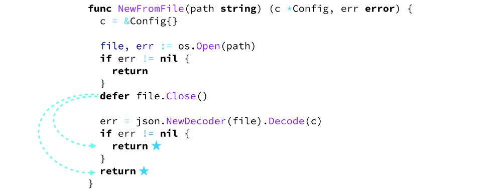

# 图解 Go 中的延迟调用 defer

> 本教程将通过几个实用的例子讲解Go语言中的 **defer** 的用法

## 什么是 defer ？

通过使用 `defer` 修饰一个函数，使其在外部函数 ["返回后"](https://medium.com/@inanc/yeah-semantically-after-is-the-right-word-fad1d5181891) 才被执行，即便外部的函数返回的是 [panic 异常](https://golang.org/ref/spec#Handling_panics)，这类函数被称作 `延迟调用函数`


----------------

* Go 语言并不需要析构函数因为其本身并没有自带构造函数，这是一个很好的取舍

* `defer` 语句与 `finally` 类似，但两者的不同是 `finally` 的作用域在其**异常块**中，而 `defer` 的作用域则限于包围它的那个函数

----------------

**更多关于defer：** 如果你好奇 `defer` 的内部机制是如何工作的，请查看 [我的评论](https://medium.com/@inanc/yeah-semantically-after-is-the-right-word-fad1d5181891) 。虽然它在 [官方文档](https://blog.golang.org/defer-panic-and-recover) 中总是被描述为 “在外部函数返回后执行”，但其中还有些不为人知的细节未被解释清楚

----------------

## defer 的常见用途

### 释放已取得的资源

使用 `defer` 的延迟调用函数经常被用于在函数体内释放已用过的资源



这个延迟函数关闭了已经打开的文件句柄不论 `NewFromFile` 函数是否抛出异常错误

### 更好地处理 panic 异常

如果 **defer** 和被触发的 **panic** 异常位于同一个 **goroutine** 中,使用了 **defer** 的延迟调用函数体能够在 **panic** 异常中幸存，且能够避免异常终止整个程序


其中的 `recover()` 函数能够返回 `panic()` 函数的参数，这就使得我们能自行处理 **panic异常** ，同时你也可以向 `panic` 中传入错误类型或其他类型的值来判断引发 **panic异常** 的究竟是哪一个值。 [更多详情](https://blog.golang.org/defer-panic-and-recover)

### 延迟闭包

一个使用了 `defer` 的延迟调用函数可以是任意类型的函数，因此，当 `defer` 作用于一个匿名函数的时候，这个函数就能够获取到外围函数体中的变量的最新状态

值得注意的是，下面的一个例子展示了延迟调用的匿名函数可以获取到局部变量 `num` 的最终状态


### 参数即时求值

Go 的运行时会在延迟调用函数声明时保存任何传递到延迟调用函数中的参数，而不是当它被运行的时候

在下面的例子中，我们定义了一个延迟闭包，其使用了上面的同名变量 `n` 并试图将 `i` 变量再次传入延迟函数来增加变量 `n` 的值

```go
func count(i int) (n int) {

  defer func() {
    n = n + i
  }(i)

  i = i * 2
  n = i

  return
}
```

我们运行这个函数看看

```go
count(10)

// 输出：30
```

**从头梳理一下**


*译者注： 可以发现传入的延迟函数的 `i` 变量在 `count()` 返回之前就已经被运行时记录了其拷贝值（也就是 10 ），即便在 `count()` 返回后闭包内使用的 `i` 变量依然是之前的拷贝值。*

上述的例子表明，通过指定返回值变量名，**defer** 还能够帮助我们在函数返回之前改变返回值的结果

### 延迟调用多个函数

如果有多个延迟函数，它们会被存储在一个`延迟栈`中，因此，最后被 `defer` 修饰的函数会在函数体返回之后先执行。

*注意：同时使用多个 `defer` 表达式可能会降低代码的可读性*

如下图所示：


输出结果如下

```
first
last
```

**具体过程动态图**


### 延迟调用对象的方法

你也可以使用 `defer` 来修饰对象的方法。但其中另含玄机，看一段例子

#### 没有使用指针作为接收者

```go
type Car struct {
  model string
}

func (c Car) PrintModel() {
  fmt.Println(c.model)
}

func main() {
  c := Car{model: "DeLorean DMC-12"}

  defer c.PrintModel()

  c.model = "Chevrolet Impala"
}
```

输出结果如下

```
DeLorean DMC-12
```

#### 使用指针对象作为接收者

```go
func (c *Car) PrintModel() {
  fmt.Println(c.model)
}
```

输出结果如下

```
Chevrolet Impala
```

#### 为什么会这样？


我们需要记住的是，当外围函数还没有返回的时候，Go的运行时就会立刻将传递给延迟函数的参数保存起来

因此，当一个以值作为接收者的方法被 **defer** 修饰时，接收者会在声明时被拷贝(在这个例子中那就是 *Car* 对象)，此时任何对拷贝的修改都将不可见(例中的 *Car.model* )，因为，接收者也同时是输入的参数，当使用  **defer** 修饰时会立刻得出参数的值(也就是 "DeLorean DMC-12" )

在另一种情况下，当被延迟调用时，接收者为指针对象，此时虽然会产生新的指针变量，但其指向的地址依然与上例中的 "c" 指针的地址相同。因此，任何修改都会完美地作用在同一个对象中


----------------

via: https://blog.learngoprogramming.com/golang-defer-simplified-77d3b2b817ff

作者：[Inanc Gumus](https://blog.learngoprogramming.com/@inanc?source=post_header_lockup)
译者：[yujiahaol68](https://github.com/yujiahaol68)
校对：[rxcai](https://github.com/rxcai)

本文由 [GCTT](https://github.com/studygolang/GCTT) 原创编译，[Go 中文网](https://studygolang.com/) 荣誉推出

